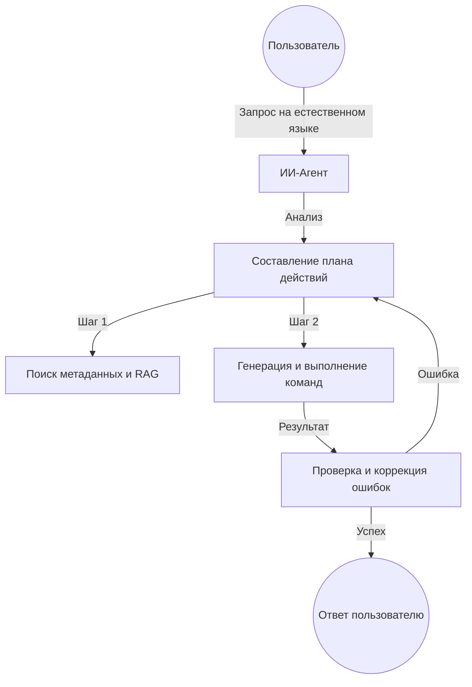

# 🚀 ИИ-Агент для 1С:Предприятие

**Превратите ваш 1С в интеллектуальную экосистему. Общайтесь с данными на естественном языке, автоматизируйте рутину и принимайте решения быстрее.**

> ⚠️ **Бета-версия** — проект в активной разработке, возможны частые обновления и изменения.

---

## ✨ Почему это меняет правила игры?

### 💼 Для бизнеса
*   **Доступность данных:** Получайте отчеты и аналитику, просто задав вопрос в чате. Больше не нужно ждать программиста для написания простого запроса.
*   **Скорость принятия решений:** Мгновенный поиск информации по всей базе данных (товары, остатки, задолженность).
*   **Снижение затрат:** Автоматизация типовых операций и первичной поддержки пользователей.

### 🛠 Для разработчиков и администраторов
*   **Умный Discovery:** Агент сам исследует метаданные, находит нужные справочники и документы, понимает связи между ними.
*   **Автогенерация запросов:** Забудьте о ручном написании сложных запросов. Агент строит их сам на языке 1С.
*   **Режим планирования:** Вы всегда видите, что собирается сделать агент. Прозрачность и контроль на каждом шаге.
*   **Безопасность из коробки:** Гибкие настройки прав доступа и Read-Only режим для защиты данных.

---

## 🧠 Как это работает?

Агент не просто отвечает на вопросы — он **действует**. Процесс работы построен на цикле автономного планирования:

---

## 💬 Что можно спросить?

*   *"Найди все заказы клиента 'ТехноПром' за прошлую неделю и выведи общую сумму."*
*   *"Какие товары на складе 'Основной' имеют остаток меньше 5 штук?"*
*   *"Создай черновик приходной накладной от поставщика 'Мир Мебели' на основании счета №123."*
*   *"Проанализируй динамику продаж за последний месяц и выдели топ-3 растущих категории."*

---

## 🛠 Ключевые возможности

*   **🤖 Автопилот:** Проактивное исследование структуры объектов и получение реквизитов.
*   **🔍 Умный RAG-поиск:** Поиск объектов конфигурации по смыслу, а не только по названию.
*   **⚡ Оптимизация контекста:** Технология *Context Saver* позволяет работать даже в огромных конфигурациях (ERP, УТ 11, КА).
*   **🔧 Умная обработка ошибок:** Автоматическое исправление сценариев и динамическая подстройка параметров модели.
*   **🔌 Гибкость:** Поддержка любых OpenAI-совместимых провайдеров (рекомендуем [Gitsell](https://gitsell.ru)).

---

## 📚 Документация

| Раздел | Описание |
| :--- | :--- |
| 📋 [**Планирование**](docs/PLANNING.md) | Глубокое погружение в механизм составления планов. |
| 💻 [**DSL Команды**](docs/DSL.md) | Описание языка, на котором агент общается с 1С. |
| 🏗 [**Архитектура**](docs/AGENT_ARCHITECTURE.md) | Техническое устройство модулей и потоки данных. |
| 🛡 [**Безопасность**](docs/SECURITY.md) | Как настроить ограничения и защитить базу. |
| 🔎 [**RAG Поиск**](docs/RAG.md) | Подробности работы семантического поиска по метаданным. |
| 🧪 [**Тестирование**](docs/TESTING.md) | Инструменты для проверки качества работы агента. |

---

## 🚀 Быстрый старт

1.  **Установка:** Загрузите расширение в вашу базу 1С.
2.  **Настройка:** Введите API-ключ вашего провайдера (например, [Gitsell](https://gitsell.ru)).
3.  **Индексация:** Запустите первичный сбор метаданных для обучения RAG-поиска.
4.  **Готово!** Откройте форму агента и задайте свой первый вопрос.

---

## 🛡 Безопасность и надежность

Мы понимаем ценность ваших данных. Агент спроектирован с учетом корпоративных стандартов:
*   **Валидация данных:** Защита от галлюцинаций — агент оперирует только реально полученными данными из БД.
*   **Контроль записи:** Возможность полного запрета на изменение данных для конкретных пользователей.

---

## ⚠️ Отказ от ответственности

Программное обеспечение предоставляется «как есть», без каких-либо гарантий, явных или подразумеваемых. Разработчики и правообладатели не несут ответственности за любые прямые, косвенные, случайные или иные убытки, возникшие в результате использования или невозможности использования данного ПО. Использование агента в производственной среде осуществляется исключительно на ваш собственный риск. Рекомендуется тщательное тестирование перед развёртыванием в критичных системах.

---

*Разработано с ❤️ для сообщества 1С.*
