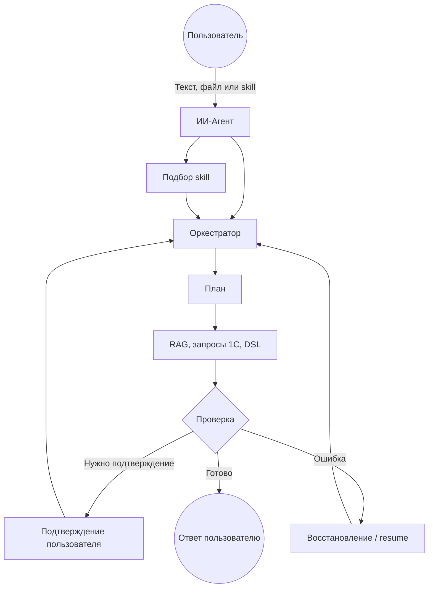

# 🚀 ИИ-Агент для 1С:Предприятие

**Превратите ваш 1С в интеллектуальную экосистему. Общайтесь с данными на естественном языке, автоматизируйте рутину и принимайте решения быстрее.**

**Текущая версия: [0.9.11](docs/releases/v0.9.11.md)**

> ⚠️ **Бета** — проект в активной разработке, возможны частые обновления и изменения.

---

## ✨ Почему это меняет правила игры?

### 💼 Для бизнеса
*   **Доступность данных:** Получайте отчеты и аналитику, просто задав вопрос в чате. Больше не нужно ждать программиста для написания простого запроса.
*   **Скорость принятия решений:** Мгновенный поиск информации по всей базе данных (товары, остатки, задолженность).
*   **Снижение затрат:** Автоматизация типовых операций и первичной поддержки пользователей.

### 🛠 Для разработчиков и администраторов
*   **Умный Discovery:** Агент сам исследует метаданные, находит нужные справочники и документы, понимает связи между ними.
*   **Автогенерация запросов:** Забудьте о ручном написании сложных запросов. Агент строит их сам на языке 1С.
*   **Режим планирования:** Вы всегда видите, что собирается сделать агент. Прозрачность и контроль на каждом шаге.
*   **Безопасность из коробки:** Гибкие настройки прав доступа и Read-Only режим для защиты данных.

---

## 🧠 Как это работает?

Агент не просто отвечает на вопросы — он **действует**. Оркестратор ведёт цикл план → выполнение → проверка, подключает skills и останавливается на подтверждении, если действие меняет данные:

```mermaid
graph TD
    User((Пользователь)) -->|Текст, файл или skill| Agent[ИИ-Агент]
    Agent --> Skills[Подбор skill]
    Agent --> Cycle[Оркестратор]
    Skills --> Cycle
    Cycle --> Plan[План]
    Plan --> Tools[RAG, запросы 1С, DSL]
    Tools --> Check{Проверка}
    Check -->|Нужно подтверждение| Confirm[Подтверждение пользователя]
    Confirm --> Cycle
    Check -->|Ошибка| Recover[Восстановление / resume]
    Recover --> Cycle
    Check -->|Готово| Final((Ответ пользователю))
```

---

## 💬 Что можно спросить?

*   *"Найди все заказы клиента 'ТехноПром' за прошлую неделю и выведи общую сумму."*
*   *"Какие товары на складе 'Основной' имеют остаток меньше 5 штук?"*
*   *"Создай черновик приходной накладной от поставщика 'Мир Мебели' на основании счета №123."*
*   *"Проанализируй динамику продаж за последний месяц и выдели топ-3 растущих категории."*

---

## 🛠 Ключевые возможности

*   **🤖 Автопилот:** Проактивное исследование структуры объектов и получение реквизитов.
*   **🧩 Skills:** Переносимые JSON-сценарии для повторяемых процессов. Реестр в 1С, генерация по описанию задачи, тестовый запуск и подтверждение на записи.
*   **📄 Распознавание документов:** PDF или изображение счёта, УПД, акта или счёт-фактуры — черновик документа в БП и УНФ.
*   **🔍 Умный RAG-поиск:** Поиск объектов конфигурации по смыслу, а не только по названию.
*   **⚡ Оптимизация контекста:** Технология *Context Saver* позволяет работать даже в огромных конфигурациях (ERP, УТ 11, КА).
*   **🔧 Умная обработка ошибок:** Автоматическое исправление сценариев, чекпоинты оркестратора и resume после сбоя.
*   **🌐 HTTP API:** Закрытый сервис `hs/iia-agent` — диалоги, вложения, запуск/стоп, подтверждение, диагностика. Без произвольного BSL и произвольных запросов.
*   **☁️ 1С:Фреш:** Отдельная редакция расширения для аудита и публикации в сервисе.
*   **🔌 Гибкость:** Поддержка любых OpenAI-совместимых провайдеров, включая локальные LLM по `http`; [Gitsell AI Proxy](https://gitsell.ru/ai-proxy) — из коробки.

---

## 📚 Документация

| Раздел | Описание |
| :--- | :--- |
| 📋 [**Планирование**](docs/PLANNING.md) | Глубокое погружение в механизм составления планов. |
| 💻 [**DSL Команды**](docs/DSL.md) | Описание языка, на котором агент общается с 1С. |
| 🏗 [**Архитектура**](docs/AGENT_ARCHITECTURE.md) | Техническое устройство модулей и потоки данных. |
| 🧭 [**LangGraph Runtime**](docs/LANGGRAPH_RUNTIME_FINAL.md) | Итоговая архитектура LangGraph-style runtime: графы, subgraphs, replay safety, policy layer, metrics и investigation API. |
| 🛡 [**Безопасность**](docs/SECURITY.md) | Как настроить ограничения и защитить базу. |
| 🔎 [**RAG Поиск**](docs/RAG.md) | Подробности работы семантического поиска по метаданным. |
| 🧪 [**Тестирование**](docs/TESTING.md) | Инструменты для проверки качества работы агента. |

**Удобное скачивание, техподдержка, подписка на обновления:** [gitsell.ru/msrv-tech/AI_agent](https://gitsell.ru/msrv-tech/AI_agent)

---

## 🚀 Быстрый старт

1.  **Установка:** Загрузите расширение в вашу базу 1С.
2.  **Настройка:** Укажите адрес OpenAI-совместимого провайдера и модель.
    Для облачного провайдера по `https` обычно нужен API-ключ.
    Для локального сервера по `http` API-ключ можно оставить пустым.
3.  **Индексация:** Запустите первичный сбор метаданных для обучения RAG-поиска.
4.  **Готово!** Откройте форму агента и задайте свой первый вопрос.

Примеры:

- `https://gitsell.ru/api/v1` + `gpt-5.4-nano`
- `https://api.openai.com/v1` + `gpt-4.1`
- `http://localhost:1234/v1` + `qwen3-8b`

---

## 🛡 Безопасность и надежность

Мы понимаем ценность ваших данных. Агент спроектирован с учетом корпоративных стандартов:
*   **Валидация данных:** Защита от галлюцинаций — агент оперирует только реально полученными данными из БД.
*   **Контроль записи:** Возможность полного запрета на изменение данных для конкретных пользователей.

---

## ⚠️ Отказ от ответственности

Программное обеспечение предоставляется «как есть», без каких-либо гарантий, явных или подразумеваемых. Разработчики и правообладатели не несут ответственности за любые прямые, косвенные, случайные или иные убытки, возникшие в результате использования или невозможности использования данного ПО. Использование агента в производственной среде осуществляется исключительно на ваш собственный риск. Рекомендуется тщательное тестирование перед развёртыванием в критичных системах.

---

## 📰 Статьи

- [**Infostart:** ИИ‑агент внутри 1С](https://infostart.ru/1c/articles/2631305/)
- [**Infostart:** ИИ агент в 1С — графовый агент, файлы и нормальные follow-up запросы 1С](https://infostart.ru/1c/articles/2688472/)
- [**Infostart:** AI Agent 0.9.3: skills и распознавание документов в 1С](https://infostart.ru/1c/articles/2748820/)

---

*Разработано с ❤️ для сообщества 1С.*
