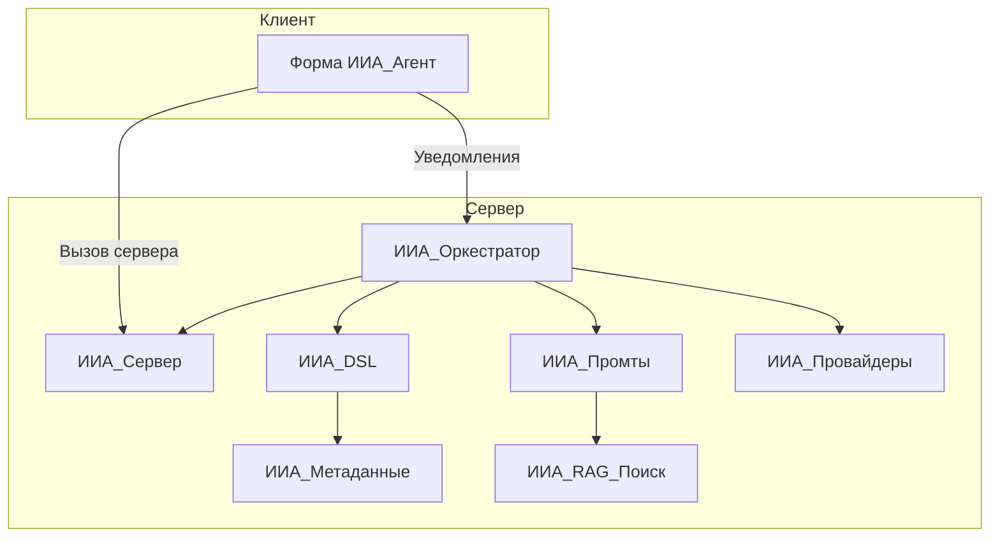

# Архитектура ИИ-Агента

## Обзор

ИИ-Агент построен на модульной архитектуре. Основные компоненты взаимодействуют через чётко определённые интерфейсы.

## Ключевые модули

| Модуль | Назначение |
|--------|------------|
| **ИИА_Сервер** | Оркестратор работы агента, управление диалогами, логирование, уведомления, логика исправления ошибок |
| **ИИА_Оркестратор** | Серверный цикл: планирование, выполнение DSL, проверка результата, генерация summary |
| **ИИА_DSL** | Интерпретатор JSON-команд (Domain Specific Language), выполняющий действия в среде 1С |
| **ИИА_Метаданные** | Работа со структурой конфигурации, поиск объектов (Левенштейн, RAG) |
| **ИИА_Промты** | Генератор системных инструкций и динамического контекста (State Summary, RAG) |
| **ИИА_Провайдеры** | Интеграция с внешними LLM (OpenAI-совместимые провайдеры, приоритет Gitsell) |
| **ИИА_RAG_*** | RAG-поиск по метаданным конфигурации |

## Поток данных

1. Пользователь отправляет сообщение через форму агента.
2. **ИИА_ВызовСервера** передаёт запрос на сервер, запускает оркестратор.
3. **ИИА_Оркестратор** в фоновом задании: планирует шаги через ИИ, выполняет DSL через **ИИА_DSL**, проверяет результат.
4. **ИИА_DSL** вызывает **ИИА_Метаданные** для GetMetadata/GetObjectFields, выполняет RunQuery, CreateReference и др.
5. **ИИА_Промты** формирует промпт с RAG-контекстом (**ИИА_RAG_Поиск**).
6. **ИИА_Провайдеры** отправляет запрос к LLM (Gitsell/OpenAI).
7. Серверные уведомления доставляют обновления клиенту в реальном времени.

## Архитектурные рекомендации по расширению

### 1) Расширяйте систему через контрактные точки

Чтобы добавлять новые возможности без «расползания» логики по модулям, фиксируйте публичные контракты:

- для DSL — единый реестр команд (`name`, `input_schema`, `idempotent`, `requires_write`);
- для провайдеров — стандартный интерфейс запроса (`messages`, `tools`, `temperature`, `timeout`);
- для RAG — отдельный контракт поиска (`query`, `top_k`, `filters`, `rerank`).

Практика: каждая новая функция сначала оформляется как контракт, и только потом реализуется в модуле.

### 2) Разделите оркестрацию на стадии пайплайна

Для роста сложности сценариев полезно явно выделить стадии:

1. `Intent` (что хочет пользователь);
2. `Plan` (какие действия и в какой последовательности);
3. `Execute` (выполнение DSL-шагов);
4. `Validate` (проверка результата, в том числе бизнес-инвариантов);
5. `Summarize` (финальный ответ пользователю).

Это упростит добавление альтернативных стратегий планирования и повторного выполнения только «проваленной» стадии.

### 3) Внедрите capability-модель для DSL-команд

Вместо простого разделения «чтение/запись» лучше ввести granular-права:

- `metadata.read`
- `data.read`
- `data.write.reference`
- `data.write.document`
- `admin.settings`

Оркестратор должен проверять capability до выполнения шага. Это снижает риск случайных изменений и упрощает аудит безопасности.

### 4) Сделайте независимый слой инструментов (Tooling Layer)

Если планируете новые интеграции (HTTP, внешние БД, очереди), лучше вынести их в отдельный слой инструментов:

- DSL работает только с абстракциями инструментов;
- инструмент сам решает детали подключения, ретраи, таймауты;
- ошибки приводятся к унифицированной модели (код, категория, рекомендация).

Так проще масштабировать систему без изменений в ядре оркестратора.

### 5) Добавьте версионирование системных промптов и DSL-контрактов

При расширении агента часто ломается обратная совместимость. Минимальный стандарт:

- `prompt_version` в журналах диалога;
- `dsl_version` в каждом плане/шаге;
- политика миграции (`N` и `N-1` поддерживаются одновременно).

Это позволит безопасно вводить новые команды и шаблоны без деградации старых сценариев.

### 6) Усильте наблюдаемость (observability) на уровне шагов

Для сопровождения и масштабирования нужны метрики не только по запросу целиком, но и по шагам:

- длительность стадий `Plan/Execute/Validate`;
- доля автокоррекций и повторов;
- топ ошибок DSL по типам;
- стоимость токенов по провайдерам и сценариям.

Рекомендуется завести корреляционный `trace_id` от UI до каждого вызова провайдера.

### 7) Подготовьте «песочницу» для безопасного расширения write-сценариев

Для новых команд записи внедряйте двухфазный режим:

1. `simulate` — агент строит и валидирует действия без фиксации;
2. `commit` — выполнение после явного подтверждения пользователя/роли.

Это особенно важно при расширении в сторону финансовых и складских документов.

### 8) Стандартизируйте расширение RAG

Чтобы наращивать качество RAG предсказуемо:

- введите стратегию чанкинга по типам объектов (справочники, документы, регистры);
- храните служебные признаки чанков (тип объекта, подсистема, дата индексации);
- разделяйте retrieval и rerank как независимые этапы.

Так можно улучшать ранжирование без пересборки всей индексации.

### 9) Организуйте архитектурные тесты-контракты

При добавлении новых модулей делайте не только функциональные, но и контрактные тесты:

- новый DSL-инструмент возвращает строго ожидаемую структуру;
- провайдер корректно обрабатывает таймаут/429/5xx;
- оркестратор не пропускает шаги без нужных capability.

Это удерживает архитектуру от «скрытой связности» по мере роста проекта.

### 10) Эволюционный roadmap расширения

Рекомендуемый порядок масштабирования:

1. стабилизация контрактов DSL/Provider/RAG;
2. capability-безопасность и шаговая observability;
3. вынос инструментов в Tooling Layer;
4. введение версионирования и миграций;
5. расширение write-сценариев через `simulate -> commit`.

Такой порядок даёт быстрый эффект по надёжности и не требует «большого переписывания».
