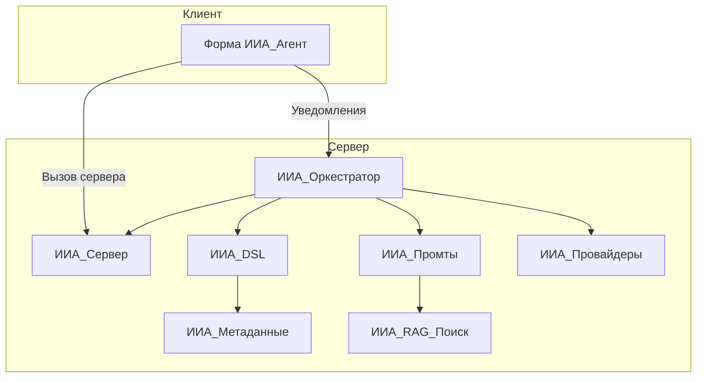

# Архитектура ИИ-Агента

## Обзор

ИИ-Агент построен на модульной архитектуре. Основные компоненты взаимодействуют через чётко определённые интерфейсы.

## Ключевые модули

| Модуль | Назначение |
|--------|------------|
| **ИИА_Сервер** | Оркестратор работы агента, управление диалогами, логирование, уведомления, логика исправления ошибок |
| **ИИА_Оркестратор** | Серверный цикл: планирование, выполнение DSL, проверка результата, генерация summary |
| **ИИА_DSL** | Интерпретатор JSON-команд (Domain Specific Language), выполняющий действия в среде 1С |
| **ИИА_Метаданные** | Работа со структурой конфигурации, поиск объектов (Левенштейн, RAG) |
| **ИИА_Промты** | Генератор системных инструкций и динамического контекста (State Summary, RAG) |
| **ИИА_Провайдеры** | Интеграция с внешними LLM (OpenAI-совместимые провайдеры, приоритет Gitsell) |
| **ИИА_RAG_*** | RAG-поиск по метаданным конфигурации |

## Поток данных

1. Пользователь отправляет сообщение через форму агента.
2. **ИИА_ВызовСервера** передаёт запрос на сервер, запускает оркестратор.
3. **ИИА_Оркестратор** в фоновом задании: планирует шаги через ИИ, выполняет DSL через **ИИА_DSL**, проверяет результат.
4. **ИИА_DSL** вызывает **ИИА_Метаданные** для GetMetadata/GetObjectFields, выполняет RunQuery, CreateReference и др.
5. **ИИА_Промты** формирует промпт с RAG-контекстом (**ИИА_RAG_Поиск**).
6. **ИИА_Провайдеры** отправляет запрос к LLM (Gitsell/OpenAI).
7. Серверные уведомления доставляют обновления клиенту в реальном времени.
