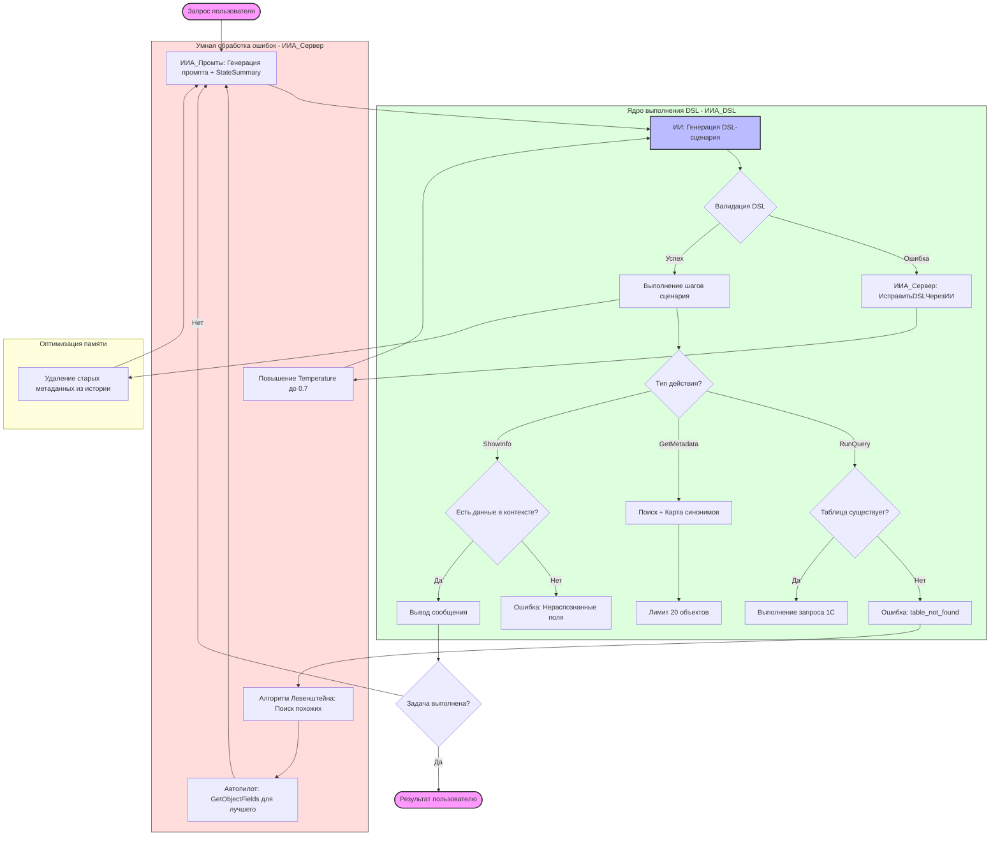

# Архитектура работы ИИ-агента 1С

В данном файле описана логика работы агента, включая механизмы Discovery, обработки ошибок и оптимизации контекста.

## Ключевые особенности

1.  **Discovery (Исследование):** Агент никогда не гадает имена объектов. Если объект не найден, включается алгоритм Левенштейна и карта синонимов 1С для поиска альтернатив.
2.  **Автопилот:** При нахождении подходящего документа система автоматически получает его реквизиты, сокращая количество итераций.
3.  **Динамическая температура:** При исправлении ошибок температура модели повышается до 0.7 для более гибкого подбора синонимов.
4.  **Context Saver:** Система агрессивно очищает историю от старых списков метаданных, оставляя только последний результат, что позволяет работать в огромных конфигурациях (ERP, УТ).
5.  **Защита от галлюцинаций:** Блокировка вывода сообщений с данными, которые не были реально получены из базы.
