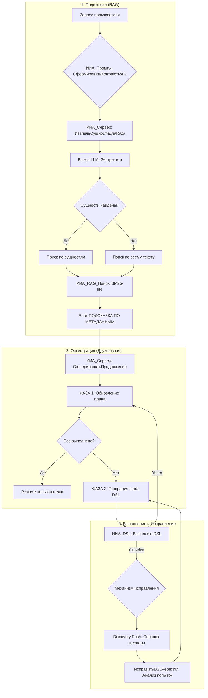

# Процесс работы Агента: RAG, Оркестрация и Самоисправление

В данном документе описана полная логика работы ИИ-агента 1С: от получения запроса и поиска метаданных до выполнения DSL и обработки ошибок.

## Блок-схема процесса (Полный цикл)

## Описание этапов

### 1. Подготовка контекста (RAG)
Система использует двухэтапный поиск для минимизации галлюцинаций в именах метаданных.
- **Экстракция сущностей:** Быстрый вызов LLM для выделения имен объектов (например, "Реализация товаров").
- **BM25-lite Поиск:** Поиск в локальном индексе с учетом весов типов (Документы > Справочники) и штрафов для технических таблиц.
- **Защита от рекурсии:** При работе RAG-экстрактора контекст RAG отключается (`БезRAG=Истина`).

### 2. Двухфазная оркестрация
Для стабильности планирование отделено от исполнения:
- **Фаза 1 (Updater):** Анализирует историю и обновляет статусы пунктов плана (`Выполнена`, `Результат`). Если всё готово — вызывает генерацию финального резюме.
- **Фаза 2 (Executor):** Генерирует DSL-код **только для одного** следующего невыполненного шага.

### 3. Механизм самоисправления (Self-Healing)
Если DSL-команда завершилась ошибкой, агент не останавливается, а пробует исправиться:

#### Discovery Push (Активные подсказки)
- **Ошибки запросов:** В промпт автоматически подмешивается полная справка по синтаксису запросов 1С.
- **Поле не найдено:** Система советует агенту выполнить `GetObjectFields` для уточнения структуры.
- **Детектор циклов:** Если агент более 2-х раз запрашивает одни и те же метаданные, он получает жесткое предупреждение о необходимости перейти к действиям.

#### Исправление через контекст попыток
Функция `ИсправитьDSLЧерезИИ` выполняет:
- **Анализ истории:** Собирает все неудачные имена объектов, которые агент уже пробовал.
- **Подбор альтернатив:** Использует нечеткий поиск (`НайтиПохожиеОбъекты`) для предложения правильных имен.
- **Запрет повторов:** Прямо указывает модели: *"Ты уже пробовал X, Y, Z — они не существуют. Используй A или B"*.

## Преимущества архитектуры
1. **Надежность:** Разделение фаз исключает бесконечные циклы "одного действия".
2. **Автономность:** Агент способен сам исправить синтаксические ошибки или неверные имена полей без участия пользователя.
3. **Прозрачность:** Каждый этап (RAG, обновление плана, выполнение DSL) логируется в `run_log.txt` и историю диалога.
