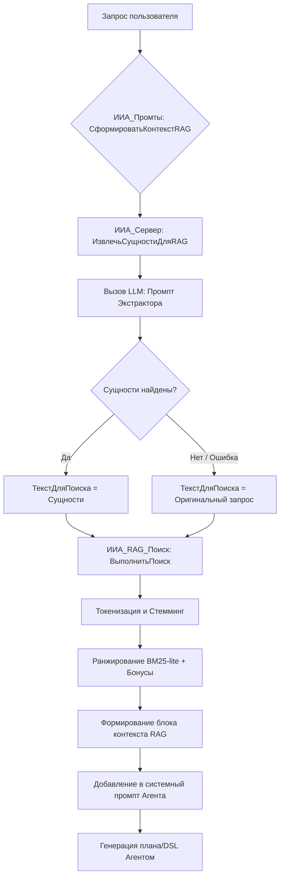

# Процесс работы RAG с экстракцией сущностей

В данном документе описана логика работы системы Retrieval Augmented Generation (RAG) в ИИ-агенте 1С после внедрения двухэтапного поиска.

## Блок-схема процесса

## Описание этапов

### 1. Экстракция сущностей (Entity Extraction)
На этом этапе исходный запрос пользователя (например, *"Найди все счета на оплату за вчера"*) передается в специальную функцию. ИИ-экстрактор выделяет только названия метаданных в именительном падеже: **"Счет на оплату"**.
- **Провайдер:** Используется быстрый вызов без сохранения истории.
- **Цель:** Убрать "шум" (даты, глаголы, предлоги), который может исказить результаты поиска в полнотекстовом индексе.

### 2. Поиск в индексе (Retrieval)
Поиск выполняется по очищенным сущностям. Если экстрактор вернул "НЕТ", используется оригинальный текст запроса.
- **Стемминг:** Слова приводятся к корням (например, "накладная" -> "накладн").
- **Ранжирование:** Применяются веса типов (Документы выше Перечислений) и штрафы для технических объектов (`...ПрисоединенныеФайлы`).

### 3. Интеграция в промпт
Результаты поиска (Top-5) оформляются в виде текстового блока `ПОДСКАЗКА ПО МЕТАДАННЫМ (RAG)`. 
- Для лучшего результата (Top-1) добавляется список полей (реквизитов).
- Агент получает четкую инструкцию: *"Всегда отдавай приоритет именам объектов и полей из этого блока"*.

## Преимущества подхода
1. **Точность:** Исключается влияние часто встречающихся слов (например, "сколько", "найти").
2. **Стабильность:** Агент реже ошибается в именах таблиц, так как получает их напрямую из метаданных базы.
3. **Гибкость:** Система сохраняет возможность поиска по полному тексту, если экстракция не удалась.
