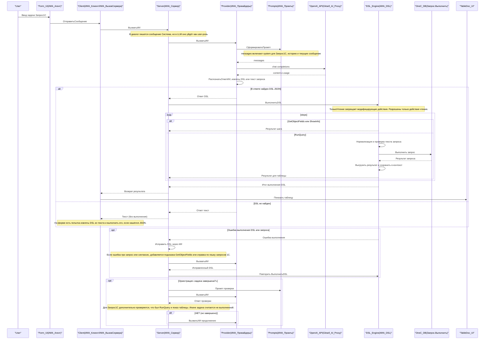

# Диаграмма процесса «Запрос 1С»

Ниже — сквозной процесс в режиме диалога **`Запрос1С`**: какие части формируют промпты (включая `system`), что возвращает модель, как извлекается DSL, как выполняется `RunQuery`, и как устроен цикл исправления ошибок.

